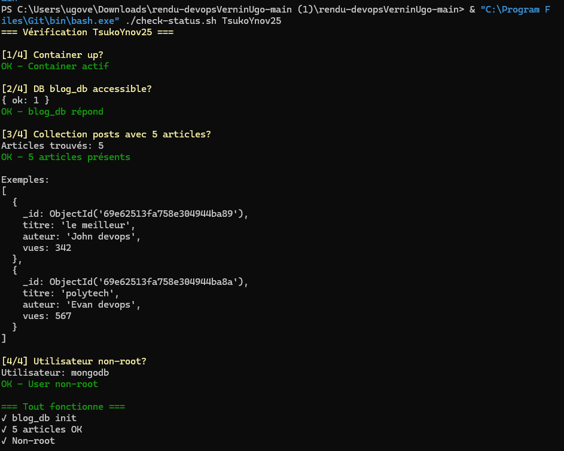
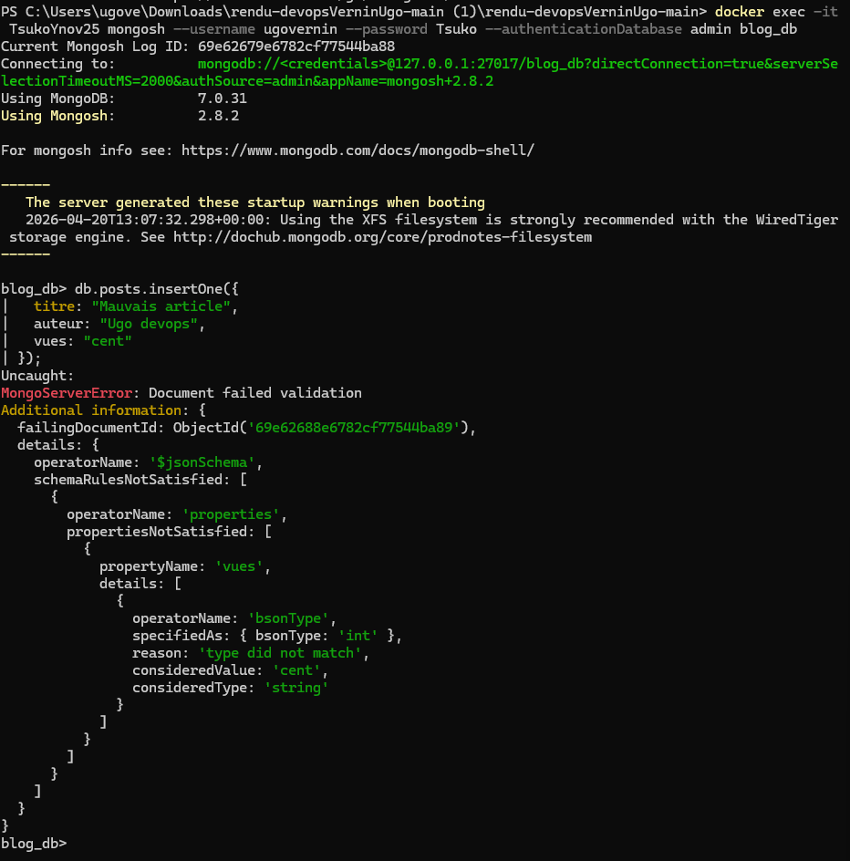
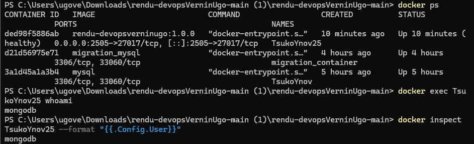

# Rendu DevOps - MongoDB

Mini projet Docker MongoDB avec base `blog_db` et collection `posts`.

## Liens

- GitHub: <https://github.com/Tsuko5/rendudevopsVerninUgo>
- Docker Hub: <https://hub.docker.com/repository/docker/tsukolucky/rendu-devopsverninugo/general>

## Lancer rapidement

```bash
cp .env.example .env
docker build -t rendu-devopsverninugo:1.0.0 .
docker run -d --name TsukoYnov25 --env-file .env -p 2505:27017 rendu-devopsverninugo:1.0.0
```

## Commandes de base

### Ouvrir Mongo

```bash
source .env
docker exec -it TsukoYnov25 mongosh --username "$MONGO_INITDB_ROOT_USERNAME" --password "$MONGO_INITDB_ROOT_PASSWORD" --authenticationDatabase admin blog_db
```

### Exécuter le script de vérification

Linux / Git Bash:
```bash
chmod +x check-status.sh
./check-status.sh TsukoYnov25
```

PowerShell:
```powershell
Copy-Item .env.example .env
bash ./check-status.sh TsukoYnov25
```

### Tester le validateur (erreur attendue)

```javascript
db.posts.insertOne({
  titre: "Mauvais article",
  auteur: "Ugo devops",
  vues: "cent"
});
```

Erreur attendue: `MongoServerError: Document failed validation`

## Preuves (captures d'ecran)

### 1) Succès du script `check-status.sh`



### 2) Erreur d'insertion invalide (validateur schema)



### 3) `docker ps` + inspection utilisateur interne



## Securite

Les identifiants sont dans `.env` (fichier local non versionne) et un modele est fourni dans `.env.example`.
